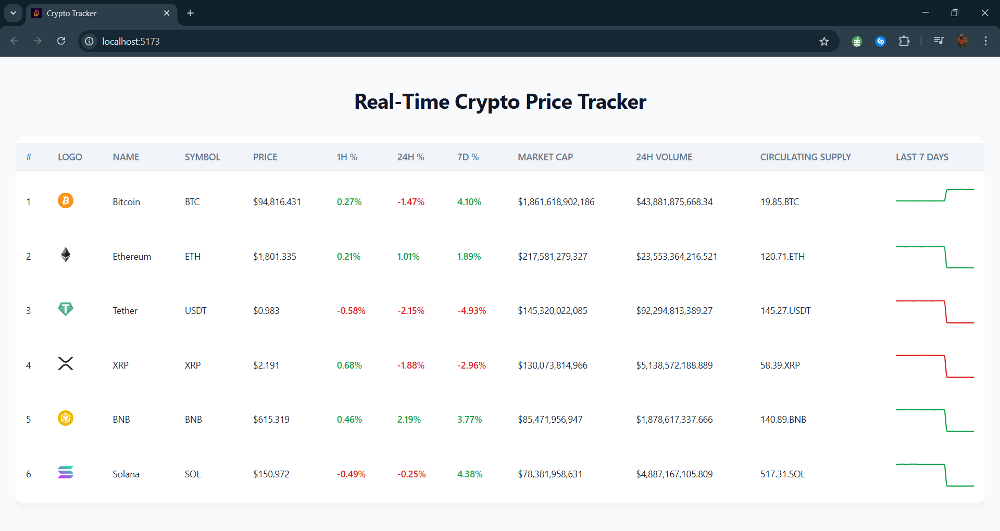

# 🚀 Real-Time Crypto Tracker

A sleek, responsive React + TypeScript app to track real-time cryptocurrency data with live-updating prices, trends, and 7-day sparkline charts. Built for speed, clarity, and a delightful user experience.



---

## 🧠 Tech Stack

| Technology         | Purpose                               |
|--------------------|----------------------------------------|
| **React**          | Frontend framework                     |
| **TypeScript**     | Type-safe JavaScript                   |
| **Redux Toolkit**  | State management                       |
| **Recharts**       | Charting for 7-day sparkline trends    |
| **CSS (custom)**   | Styling with clean modern aesthetics   |

---

## 📦 Setup Instructions

### 1. Clone the Repository

```bash
git clone https://github.com/jainmanan2409/crypto-price-tracker.git
cd crypto-price-tracker
```
### 2. Install Dependencies

```bash
npm install
```

### 3. Start the Development Server

```bash
npm run dev
```

Open your browser and navigate to http://localhost:5173 to view the application.

---

## ⚙️ Configuration

You can configure and customize the crypto price tracker using the following files:

### 🔁 Update Interval
- **File**: `src/components/PriceUpdater.tsx`

### 🧪 Mock Data
- **File**: `src/utils/mockData.ts`

### 🎨 Chart Colors
- **File**: `src/components/MiniCharts.tsx`

### 🎨 Styling
- **File**: `src/styles/CryptoTable.css`

---

## 🎥 Demo

### 🧪 Video Preview


---


